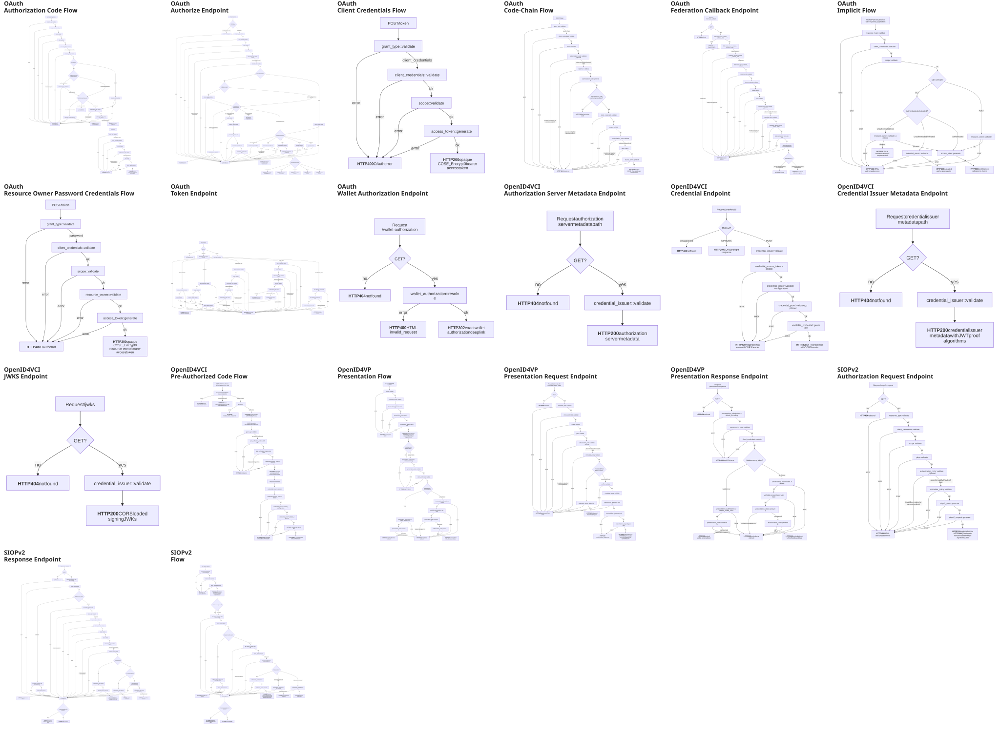

# Identity Flow Graphs

This catalog brings together every rendered identity-flow and endpoint graph.
Mermaid (`.mmd`) files remain the canonical sources; the adjacent SVG files are
generated artifacts. Detailed protocol notes live in each specification's
README.

## Complete Overview

The following self-contained landscape image combines every rendered graph in
this catalog.

## OAuth

[OAuth documentation](oauth/README.md)

### Authorization Code Flow

[Mermaid source](oauth/authorization_code.mmd)

### Authorize Endpoint

[Mermaid source](oauth/authorize_endpoint.mmd)

### Client Credentials Flow

[Mermaid source](oauth/client_credentials.mmd)

### Code-Chain Flow

[Mermaid source](oauth/code_chain.mmd)

### Federation Callback Endpoint

[Mermaid source](oauth/federation_callback.mmd)

### Implicit Flow

[Mermaid source](oauth/implicit.mmd)

### Resource Owner Password Credentials Flow

[Mermaid source](oauth/resource_owner_password_credentials.mmd)

### Token Endpoint

[Mermaid source](oauth/token_endpoint.mmd)

### Wallet Authorization Endpoint

[Mermaid source](oauth/wallet_authorization_endpoint.mmd)

## OpenID4VCI

[OpenID4VCI documentation](openid4vci/README.md)

### Authorization Server Metadata Endpoint

[Mermaid source](openid4vci/authorization_server_metadata_endpoint.mmd)

### Credential Endpoint

[Mermaid source](openid4vci/credential_endpoint.mmd)

### Credential Issuer Metadata Endpoint

[Mermaid source](openid4vci/credential_issuer_metadata_endpoint.mmd)

### Credential Offer Endpoint

[Mermaid source](openid4vci/credential_offer_endpoint.mmd)

### JWKS Endpoint

[Mermaid source](openid4vci/jwks_endpoint.mmd)

### Pre-Authorized Code Flow

[Mermaid source](openid4vci/pre_authorized_code.mmd)

## OpenID4VP

[OpenID4VP documentation](openid4vp/README.md)

### Presentation Flow

[Mermaid source](openid4vp/presentation.mmd)

### Presentation Request Endpoint

[Mermaid source](openid4vp/presentation_request_endpoint.mmd)

### Presentation Response Endpoint

[Mermaid source](openid4vp/presentation_response_endpoint.mmd)

## SIOPv2

[SIOPv2 documentation](siopv2/README.md)

### Authorization Request Endpoint

[Mermaid source](siopv2/authorization_request_endpoint.mmd)

### Response Endpoint

[Mermaid source](siopv2/response_endpoint.mmd)

### SIOPv2 Flow

[Mermaid source](siopv2/siopv2.mmd)

