# OAuth Flow Graphs

This directory documents the branching behavior of Kagome's OAuth flows and
endpoints. Mermaid (`.mmd`) files are the canonical sources; matching `.svg`
files are generated artifacts for viewing in documentation and code reviews.

When an authorization request contains `state`, every successful client
authorization response returns that exact value. An authorization error also
returns the exact state by redirect when the client and redirect URI are
independently trusted; otherwise Kagome renders a local HTML error and does not
disclose state to the untrusted URI.

Flow graphs describe the end-to-end business rules for a grant or authorization
flow. Endpoint graphs describe request dispatch and how flow results become HTTP
responses.

## Authorization Code Flow

[Mermaid source](authorization_code.mmd)

## Client Credentials Flow

[Mermaid source](client_credentials.mmd)

## Implicit Flow

[Mermaid source](implicit.mmd)

## Resource Owner Password Credentials Flow

[Mermaid source](resource_owner_password_credentials.mmd)

## Code-Chain Flow

[Mermaid source](code_chain.mmd)

## `/authorize` Endpoint

[Mermaid source](authorize_endpoint.mmd)

## `/token` Endpoint

[Mermaid source](token_endpoint.mmd)

## `/federation_callback` Endpoint

After the encrypted callback state validates the original client and redirect
URI, callback, token-exchange, identity-fetch, and authorize-continuation errors
redirect to that URI with `error`, `error_description`, and the original client
`state`. Missing or invalid callback state remains a local JSON error.
For QR-enabled clients, a pre-authorized-code continuation carrying a validated
ID-token public key redirects directly to the wallet callback instead of
rendering another QR relay.

[Mermaid source](federation_callback.mmd)

## Review Checklist

- Update the Mermaid source and rendered SVG together.
- Keep the graph closed: every edge starts at a defined node, and every path
  ends at a defined success or error outcome.
- Include every behavior-affecting decision represented by the implementation.
- Use branch labels and outcome names that match the integration-test matrix.
- Add or update tests for every reachable path changed by the graph update.
- Document impossible or intentionally equivalent paths in the relevant test
  module's branch matrix.
