# OpenID4VCI Flow Graphs

These graphs document Kagome's bounded OpenID for Verifiable Credential
Issuance 1.0 pre-authorized-code profile. Mermaid (`.mmd`) files are canonical;
the adjacent SVG files are rendered for direct review.

## Issuance Flow

[Mermaid source](pre_authorized_code.mmd)

## Credential Issuer Metadata Endpoint

[Mermaid source](credential_issuer_metadata_endpoint.mmd)

## Authorization Server Metadata Endpoint

[Mermaid source](authorization_server_metadata_endpoint.mmd)

## Credential Offer Endpoint

[Mermaid source](credential_offer_endpoint.mmd)

## Credential Endpoint

The credential request may include a JWT proof. A valid asymmetric proof binds
the issued credential subject and `cnf.jwk` to the wallet's DID and public key;
the proof audience must be the credential issuer and its `iat` must be recent.
Requests without a proof retain the access-token subject fallback.
For an authorize client configured with `require_wallet_binding: true`, the
incoming authorization code must carry a valid ID token with an asymmetric
public JWK. Kagome carries that JWK through the encrypted pre-authorized code
and signed credential access token, requires an issuance proof, and verifies
the proof signature against both its declared wallet key and the ID-token key.

[Mermaid source](credential_endpoint.mmd)

## JWKS Endpoint

[Mermaid source](jwks_endpoint.mmd)

## Review Checklist

- Keep every graph closed with no dangling paths.
- Keep branch labels aligned with the integration-test matrix.
- Update Mermaid sources, rendered SVGs, and tests together.
