# OpenID4VP Flow Graphs

These graphs document Kagome's bounded OpenID for Verifiable Presentations 1.0
direct-post verifier profile. Mermaid (`.mmd`) files are canonical; the adjacent
SVG files are rendered for direct review.

## Presentation Flow

[Mermaid source](presentation.mmd)

## Presentation Request Endpoint

`GET /authorize?response_type=vp_token` selects this flow through the main
authorize handler. It uses the common authorize response-type, client and
redirect URI, optional code, and metadata-policy validations before the
authorize response-generation presentation branch creates the verifier state.
For clients configured with `require_wallet_binding: true`, the code is
mandatory and must carry a valid ID token with an embedded asymmetric public
JWK. That JWK is protected in presentation state, and the returned VP JWT
signature is verified against both its declared wallet key and the ID-token
key.
The handler redirects to the validated authorize `redirect_uri` with the
normalized configured server `issuer` as Kagome's pre-registered verifier
`client_id`, `response_type=vp_token`, and a signed JWT in its `request` query
parameter. It separately carries the verifier callback as `redirect_uri`. The
outer client identifier, response type, and callback URI match their signed
claims. The callback includes the encrypted presentation `state` in its query
so wallet form posts remain transaction-bound. The verifier client identifier
and callback origin come from the configured server `issuer`, independently of
the request `Host`. The request `Host` remains the validated credential issuer
origin bound into presentation state. The request object contains the
Presentation Exchange `presentation_definition`; the direct-post response binds
its `presentation_submission` descriptor map to that definition before
validating the presentation and credential. The response validator also accepts
Boruta wallet's credential-bound descriptor representation, whose omitted
definition identifier is recovered from authenticated presentation state. Its
wallet-defined nested descriptor identifier is treated as opaque and may
contain any non-empty value, while its credential type, formats, and paths
remain strictly checked.

Presentation JWTs may use any asymmetric algorithm supported by the JWT
implementation: ECDSA, RSA PKCS#1, RSA-PSS, or EdDSA. Symmetric HMAC algorithms
are rejected. The presentation signature key is resolved from an embedded
header `jwk`, falling back to an issuer-bound P-256 `did:key` in `kid`. Its
RFC 7638 SHA-256 thumbprint must match the issuer-signed credential's `cnf.jwk`
thumbprint. Credential-subject and presentation-issuer equality is also
required, so possession of an unrelated presentation key cannot establish the
credential holder.

The verifier accepts the standard nested JWT VP profile and Boruta wallet's
compact top-level VP profile. Both require `aud` to equal the verifier
`client_id` from the signed presentation request, `iat` not to be in the future,
and an unexpired `exp` later than `iat`. The nonce binds the response to the
short-lived encrypted request state; the compact profile additionally binds the
presentation-definition ID and requires its issuer and subject to match.

After successful presentation validation, Kagome generates an authorization
code for the original validated authorize client and redirects to that client's
redirect URI with `code` and the original client `state`. Wallet errors and
validation failures occurring after presentation-state validation and current
client/redirect-URI revalidation redirect to the same URI with `error`,
`error_description`, and `state`. This revalidated destination is the trusted
redirect URI. Failures before a trusted redirect URI is established return an
escaped local HTML error page.

[Mermaid source](presentation_request_endpoint.mmd)

## Presentation Response Endpoint

[Mermaid source](presentation_response_endpoint.mmd)

## Review Checklist

- Keep every graph closed with no dangling paths.
- Keep branch labels aligned with the integration-test matrix.
- Update Mermaid sources, rendered SVGs, and tests together.
